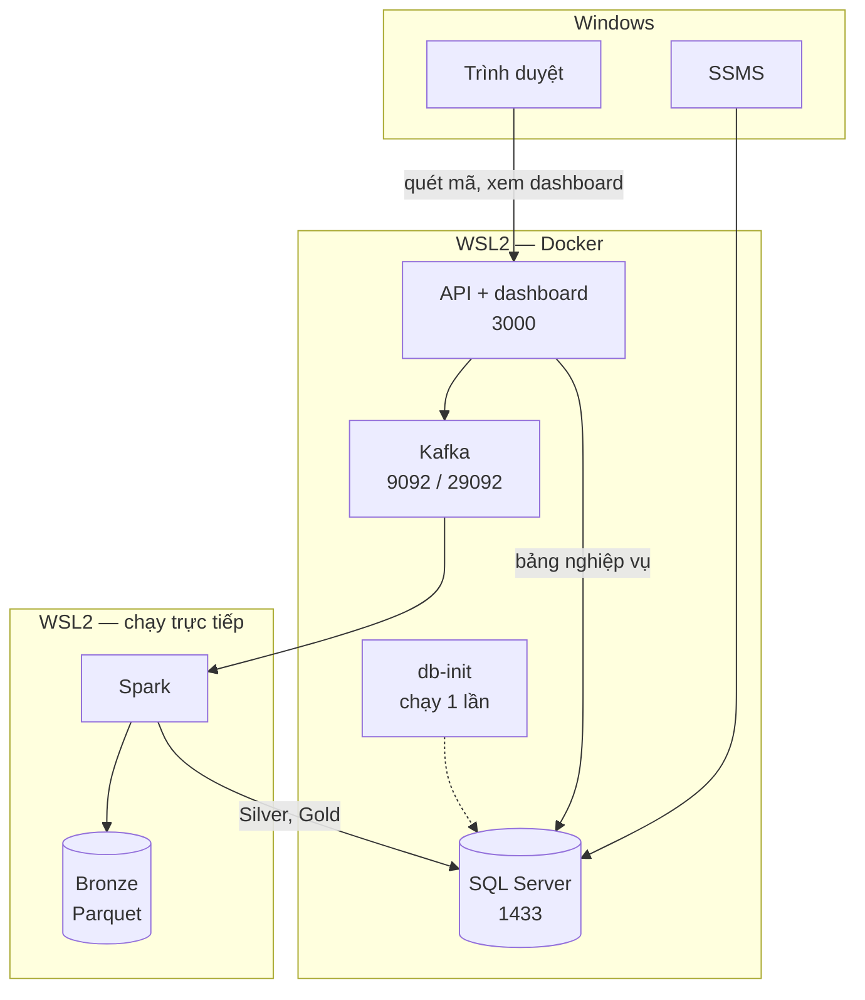

# 11 — Architecture (Phase 2)

Chốt cái gì chạy ở đâu, nối với nhau bằng đường nào, và chạy thế nào trên máy của nhóm.

Không lặp lại nội dung đã có nguồn chuẩn riêng:

| Nội dung | Nguồn |
|---|---|
| Luồng nghiệp vụ | `Requirements/04_MVP.md` |
| Cấu trúc scan event | `Requirements/08_Scan_Event_Specification.md` |
| Kết quả scan, thứ tự ưu tiên | `Requirements/07_Scan_Results.md` |
| Trạng thái vé | `Requirements/06_Ticket_Lifecycle.md` |
| Quy tắc gian lận | `Requirements/09_Fraud_Rules.md` |

---

## 1. Ngăn xếp

| Thành phần | Chọn | Chạy ở đâu |
|---|---|---|
| Cơ sở dữ liệu | SQL Server 2022 Developer | Docker |
| API | Node.js + Express | Docker |
| Hàng đợi sự kiện | Kafka, chế độ KRaft | Docker |
| Xử lý luồng | Spark, PySpark, `local[2]` | WSL2, chạy trực tiếp |
| Dashboard | Trang web tự viết, API phục vụ luôn | Docker, cùng API |
| Công cụ quản trị DB | SSMS | Windows, chỉ là client |


---

## 2. Sơ đồ triển khai



### Đọc sơ đồ này thế nào

**Ba khung là ba nơi khác nhau trên cùng một máy tính.**

Máy của bạn chạy Windows. Bên trong Windows có một máy Linux thu nhỏ tên là **WSL2** — nó có sẵn
trong Windows, chỉ cần bật lên. Docker bắt buộc phải có nó mới chạy được.

**Docker** là cách đóng gói mỗi phần mềm vào một cái hộp riêng, bên trong hộp có sẵn mọi thứ phần
mềm đó cần. Cài bằng một lệnh, xóa bằng một lệnh, và hộp trên máy bạn giống hệt hộp trên máy ba
người kia. Mỗi cái hộp đang chạy gọi là một **container**.

Vậy ba khung là:

| Khung | Nghĩa là |
|---|---|
| Windows | Phần mềm cài bình thường trên máy, bạn mở bằng cách bấm vào biểu tượng |
| WSL2 — Docker | Các hộp Docker, bật tắt bằng lệnh |
| WSL2 — chạy trực tiếp | Nằm trong máy Linux thu nhỏ nhưng không đóng hộp |

### Đi theo một lượt quét vé

Cách nhanh nhất để hiểu sơ đồ là đi theo một lượt quét từ đầu đến cuối.

1. Nhân viên mở **trình duyệt** trên Windows, quét mã QR trên vé.
2. Trình duyệt gửi thông tin lượt quét sang **API**.
3. API làm hai việc: đẩy một bản tin vào **Kafka**, và tra bảng vé trong **SQL Server** nếu cần.
4. **Spark** chạy sẵn từ trước, liên tục lấy bản tin mới từ Kafka.
5. Spark ghi bản tin thô xuống **Bronze** — đây chỉ là các tệp nằm trên ổ đĩa, không phải phần mềm.
6. Spark xử lý theo quy tắc ở file 07 và 09, rồi ghi kết quả vào **SQL Server**.
7. Trang dashboard hỏi API mỗi giây. API đọc bảng thống kê trong SQL Server rồi trả về. Cảnh báo
   hiện lên màn hình.

**SSMS** không nằm trong luồng trên. Nó chỉ là cửa sổ để bạn nhìn vào cơ sở dữ liệu, giống như mở
File Explorer để xem một thư mục.

### Hai chỗ trông lạ trong sơ đồ

**Đường nét đứt tới db-init.** Đây không phải thành phần của hệ thống. Nó là một cái hộp chỉ chạy
đúng một lần lúc dựng môi trường: tạo bảng, nạp dữ liệu mẫu, rồi tự tắt. Vẽ nét đứt để phân biệt với
những hộp chạy suốt.

**Spark nằm trong WSL2 nhưng không đóng hộp.** Hai lý do. Đóng hộp Spark theo cách thông thường phải
dựng hai container và tốn gấp đôi bộ nhớ. Và mỗi lần sửa code lại phải đóng hộp lại, trong khi chạy
trực tiếp thì sửa xong chạy lại ngay.

### Một điều cần nhớ khi cài

Đặt repo **bên trong WSL2**, không để ở `/mnt/c/`. Spark đọc ghi qua ranh giới giữa Windows và Linux
chậm hơn nhiều lần.

---

## 3. Ba tầng dữ liệu

| Tầng | Ở đâu | Định dạng | Ai ghi |
|---|---|---|---|
| Bronze | `data/bronze/scan_events/` trong WSL2 | Parquet, chia theo ngày rồi giờ | Chỉ Spark |
| Silver | Bảng `scan_event` | Bảng quan hệ | Chỉ Spark |
| Gold | Các bảng thống kê | Bảng quan hệ | Chỉ Spark |

Bronze ghi nguyên bản tin, không sửa gì. `data/` nằm trong `.gitignore`.

### Ba điều cấm

1. Máy quét không ghi thẳng vào cơ sở dữ liệu — mọi lượt quét đi qua API rồi vào Kafka.
2. Dashboard không đọc bảng Silver — đã có Gold thì đọc Gold.
3. API không tự kết luận hợp lệ hay gian lận — việc đó của Spark, theo file 07 và 09.

---

## 4. SQL Server

| Hạng mục | Giá trị |
|---|---|
| Ảnh | `mcr.microsoft.com/mssql/server:2022-latest` |
| Bộ nhớ | `MSSQL_MEMORY_LIMIT_MB=2048` — bản Linux đòi tối thiểu 2GB, dưới ngưỡng là không khởi động |
| Collation | `Vietnamese_CI_AS`, khai qua `MSSQL_COLLATION` |
| Kiểu chuỗi | `NVARCHAR` cho **mọi** cột chuỗi, kể cả cột mã |
| Dữ liệu | Named volume — không khai thì `down` là mất sạch |
| Thư mục sao lưu | Gắn ra ngoài container |
| Healthcheck | `sqlcmd -Q "SELECT 1"` |

**Collation chỉ đặt được một lần.** `MSSQL_COLLATION` chỉ có tác dụng ở lần khởi tạo đầu tiên. Đổi
sau này phải xóa volume và dựng lại từ đầu, mất hết dữ liệu.

**Không phân biệt hoa thường.** Ràng buộc kiểm tra `scan_result` sẽ nhận cả giá trị viết thường.
Muốn chặt hơn thì C thêm ràng buộc so với chuỗi viết hoa.

**Dùng `NVARCHAR` cho mọi cột chuỗi**, không trộn với `VARCHAR` — trộn hai kiểu trong điều kiện join
gây chuyển kiểu ngầm và làm index không được dùng, ảnh hưởng trực tiếp tới phần Indexing.

**Nạp dữ liệu ban đầu.** Ảnh SQL Server không tự chạy script lúc khởi tạo. Chạy `init.sql` ngay khi
container vừa lên là thất bại vì SQL Server mất 30–60 giây mới nhận kết nối. Thêm service `db-init`
chờ healthcheck rồi nạp `init.sql` và `seed.sql`, xong tự thoát.

---

## 5. Kafka

| Hạng mục | Giá trị |
|---|---|
| Topic | `scan-events` |
| Topic bản tin hỏng | `scan-events-dlq` |
| Phần vùng | 3 |
| **Khóa phân vùng** | **`ticket_id`** |
| Bản sao | 1 |
| Giữ dữ liệu | 7 ngày |
| Bộ nhớ | `KAFKA_HEAP_OPTS=-Xmx512m -Xms512m` |

**Vì sao khóa là mã vé.** Kafka chỉ giữ thứ tự trong cùng một phần vùng. Khóa ngẫu nhiên thì các lần
quét của một vé rơi vào các phần vùng khác nhau, quy tắc 4 so nhầm lần quét trước và cho kết quả sai.
Lỗi này chỉ hiện khi chạy nhiều consumer — đúng lúc đo tải — và rất khó tìm.

**Hai đường vào.** Kafka trong Docker, Spark ngoài Docker:

| Đường | Địa chỉ | Ai dùng |
|---|---|---|
| Trong | `kafka:29092` | API |
| Ngoài | `localhost:9092` | Spark |

Chỉ khai đường trong thì Spark kết nối được rồi treo, báo lỗi không nói gì về nguyên nhân. SQL Server
cùng quy luật: API gọi `sqlserver`, Spark và SSMS gọi `localhost`.

---

## 6. Dashboard

Một trang, API phục vụ luôn ở cổng 3000.

| Phần | Cách chạy | Nội dung |
|---|---|---|
| Theo dõi trực tiếp | Tự làm mới mỗi giây | Tổng lượt quét, số theo từng kết quả, tỷ lệ gian lận, cảnh báo mới nhất |
| Thống kê | Tải một lần, có nút làm mới | Biểu đồ theo cổng, theo thời gian, tỷ lệ các loại kết quả |

```
GET /api/dashboard/live     → số liệu tức thời và cảnh báo mới nhất
GET /api/dashboard/stats    → tổng hợp theo cổng và theo thời gian
```

Cả hai đọc từ Gold. Thư viện biểu đồ tải về để trong repo, không lấy từ mạng — phòng hôm demo mạng
chập chờn.

---

## 7. Ba chế độ chạy

| Chế độ | Lệnh | Docker bật gì | Thêm |
|---|---|---|---|
| Ứng dụng | `--profile app` | SQL Server, db-init, API | — |
| Luồng | `--profile stream` | SQL Server, db-init, Kafka | Spark |
| Đầy đủ | `--profile full` | Tất cả | Spark |

Ngày thường dùng chế độ ứng dụng hoặc chế độ luồng. Chế độ đầy đủ chỉ bật khi ghép nối và chạy demo,
lúc đó nên đóng trình soạn thảo và bớt tab trình duyệt.

`.wslconfig` trong thư mục người dùng Windows:

```
[wsl2]
memory=5GB
processors=4
```

Không đặt thì WSL2 lấy tới một nửa RAM máy.

Máy nào vẫn quá tải: chuyển riêng máy đó sang cài SQL Server trên Windows. Chuỗi kết nối từ máy thật
giống nhau ở cả hai cách nên ba người kia không bị ảnh hưởng.

---

## 8. Cổng và biến môi trường

| Dịch vụ | Cổng |
|---|---|
| SQL Server | 1433 |
| Kafka ngoài / trong | 9092 / 29092 |
| API kiêm dashboard | 3000 |

`.env.example` trong repo, mỗi người sao thành `.env`:

```
DB_HOST_INTERNAL=sqlserver
DB_HOST_EXTERNAL=localhost
DB_PORT=1433
DB_NAME=ticket_system
DB_USER=sa
DB_PASSWORD=
DB_ENCRYPT=false
DB_COLLATION=Vietnamese_CI_AS

KAFKA_INTERNAL=kafka:29092
KAFKA_EXTERNAL=localhost:9092
KAFKA_TOPIC=scan-events
KAFKA_DLQ_TOPIC=scan-events-dlq

API_PORT=3000
QR_HMAC_SECRET=
FRAUD_CONFIG_PATH=./config/fraud-rules.json
```

Quy luật: trong Docker gọi bằng tên service, ngoài Docker gọi bằng `localhost`.

`.env` nằm trong `.gitignore`.
