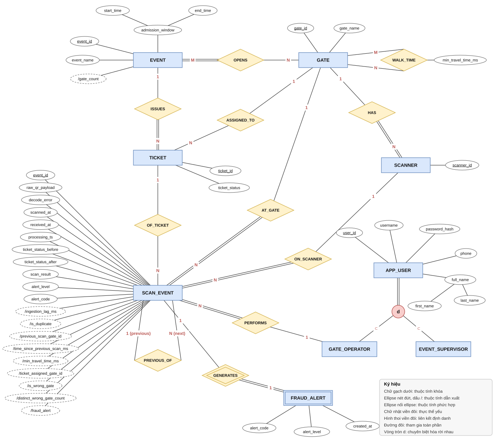
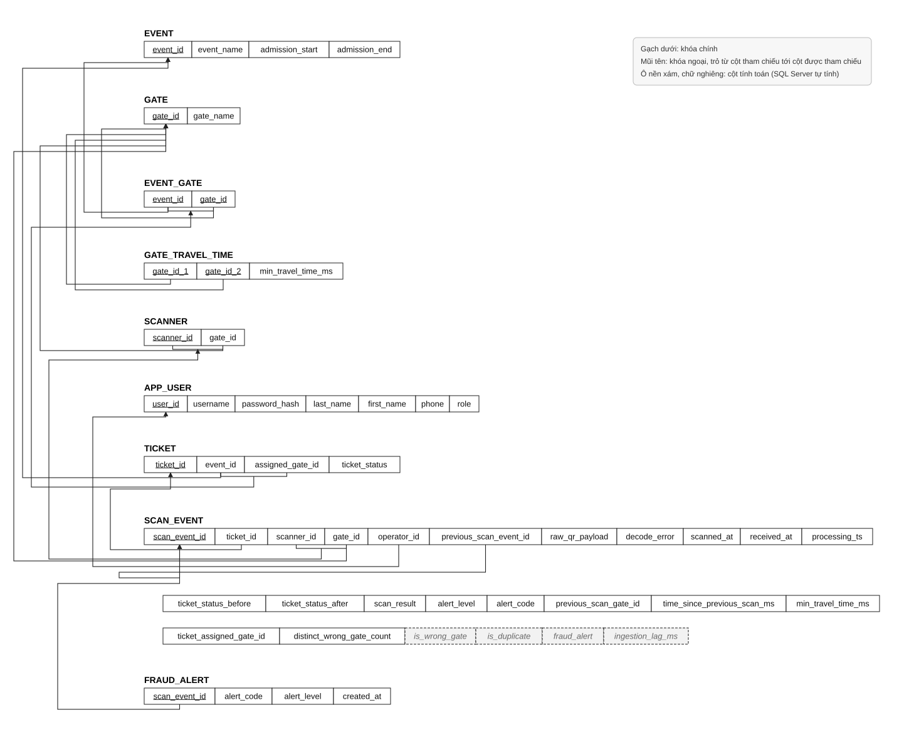

# 12 — Database Schema

Thiết kế cơ sở dữ liệu `ticket_system` trên SQL Server 2022: từ đặc tả, EERD, lược đồ quan hệ, tới từ điển dữ liệu dùng để viết `database/init.sql`.

**Mục lục**

1. Đặc tả hệ thống
2. Mô hình EERD
3. Lược đồ quan hệ
4. Từ điển dữ liệu
5. Ràng buộc kiểm tra ngoài cơ sở dữ liệu

---

## 1. Đặc tả hệ thống

### Mô tả hệ thống

Ban tổ chức cần một hệ thống kiểm vé tại cổng cho các sự kiện đông người như hòa nhạc hay hội thảo. Khi khách đến cổng, nhân viên soát vé dùng máy quét đọc mã QR trên vé. Hệ thống ghi nhận mọi lượt quét, trả về kết quả cho nhân viên gần như tức thì, cập nhật trạng thái của vé và phát cảnh báo khi phát hiện dấu hiệu gian lận như vé giả, vé đã bị thu hồi, vé đã vào rồi bị quét lại, hay hai người dùng chung một vé ở hai cổng khác nhau. Người giám sát sự kiện theo dõi các lượt quét và các cảnh báo trên bảng điều khiển. Hệ thống lưu được nhiều sự kiện, nhưng mỗi lần vận hành chỉ phục vụ một sự kiện đang diễn ra, vé của sự kiện khác quét tại cổng đều bị xem là không hợp lệ.

### Sự kiện, cổng và máy quét

Hệ thống phục vụ một địa điểm tổ chức có nhiều cổng vào cố định. Mỗi cổng có mã cổng duy nhất và một tên cổng để hiển thị.

Mỗi sự kiện có một mã sự kiện duy nhất để phân biệt với các sự kiện khác, một tên sự kiện và khung giờ nhận khách. Khung giờ nhận khách gồm giờ bắt đầu và giờ kết thúc, ngoài khung giờ này vé chưa dùng sẽ không được cho vào.

Vì cổng là cổng thật của địa điểm nên một sự kiện mở nhiều cổng, và một cổng được dùng cho nhiều sự kiện khác nhau. Mỗi sự kiện phải mở ít nhất một cổng. Số cổng mở cho một sự kiện không lưu riêng mà được đếm từ các cổng sự kiện đó sử dụng, và con số này được dùng để quyết định khi nào một vé đi sai cổng quá nhiều lần bị xem là gian lận.

Giữa hai cổng bất kỳ của địa điểm, ban tổ chức ghi lại thời gian đi bộ ngắn nhất từ cổng này sang cổng kia, tính bằng giây và lấy theo người đi nhanh nhất. Vì cổng cố định nên con số này đo một lần và dùng chung cho mọi sự kiện. Thời gian này thuộc về cặp cổng chứ không thuộc về riêng cổng nào, và giống nhau theo cả hai chiều, nghĩa là từ cổng A sang cổng D mất bao lâu thì từ D về A cũng mất bấy nhiêu. Một cổng không có thời gian đi bộ với chính nó.

Mỗi cổng có một hoặc nhiều máy quét, mỗi máy quét đặt tại đúng một cổng. Máy quét có mã máy quét duy nhất trong toàn hệ thống.

### Vé

Mỗi vé có một mã vé duy nhất, được in vào mã QR. Vé thuộc về đúng một sự kiện, một sự kiện phát hành nhiều vé. Vé có thể được chỉ định vào một cổng nhất định, cũng có thể không được chỉ định cổng nào, và một cổng có thể được chỉ định cho nhiều vé. Nếu vé được chỉ định cổng thì cổng đó phải là một trong các cổng mà sự kiện của vé sử dụng. Hệ thống chỉ có một loại vé, không phân biệt vé thường hay vé VIP.

Vé luôn ở một trong năm trạng thái: chưa sử dụng, đã vào hợp lệ, bị gắn cờ gian lận, hết hạn và đã hủy. Vé mới phát hành ở trạng thái chưa sử dụng. Mỗi vé chỉ được vào một lần, nên khi vé đã ở trạng thái đã vào hợp lệ hoặc bị gắn cờ gian lận thì mọi lần quét sau đều không cho vào. Vé đã hủy là vé bị ban tổ chức thu hồi. Trạng thái của vé chỉ được thay đổi bởi phần xử lý lượt quét hoặc bởi thao tác nhập và thu hồi danh sách vé, không ai được sửa tay.

### Người dùng

Người sử dụng hệ thống được quản lý qua tài khoản. Mỗi tài khoản có mã người dùng duy nhất, tên đăng nhập không trùng với tài khoản khác, mật khẩu đã được mã hóa, họ tên gồm họ và tên, cùng một số điện thoại liên lạc. Người dùng chia thành hai loại không giao nhau là nhân viên soát vé và người giám sát sự kiện, mỗi tài khoản thuộc đúng một trong hai loại.

Nhân viên soát vé là người cầm máy quét tại cổng. Người giám sát sự kiện là người theo dõi bảng điều khiển và xem cảnh báo.

### Lượt quét

Mỗi lần máy quét đọc một mã QR tạo ra một lượt quét. Lượt quét có mã lượt quét duy nhất do máy chủ sinh ra ngay khi nhận được, nhờ đó nếu phần xử lý đọc lại cùng một lượt quét hai lần thì hệ thống chỉ ghi nhận một lần. Lượt quét lưu lại nội dung QR thô đọc được, lỗi giải mã nếu không đọc được, giờ trên máy quét lúc quét, giờ máy chủ nhận được lượt quét và giờ hệ thống xử lý xong. Chỉ giờ máy chủ nhận được mới được dùng để so sánh và tính toán, giờ trên máy quét chỉ để tham khảo vì đồng hồ các máy có thể lệch nhau. Độ trễ xử lý của lượt quét không cần lưu vì tính được bằng giờ xử lý xong trừ giờ máy chủ nhận.

Mỗi lượt quét diễn ra tại đúng một cổng và trên đúng một máy quét. Nếu máy quét yêu cầu đăng nhập thì lượt quét còn ghi lại nhân viên soát vé đã thực hiện, còn không thì để trống. Một cổng, một máy quét hay một nhân viên soát vé có thể có nhiều lượt quét. Máy quét ghi trên lượt quét phải là máy đặt tại chính cổng ghi trên lượt quét đó.

Lượt quét thường gắn với đúng một vé và một vé có thể bị quét nhiều lần. Riêng khi mã QR không đọc được hoặc không chứa mã vé thì lượt quét không gắn với vé nào. Lượt quét luôn thuộc về sự kiện đang được phục vụ, nên không cần ghi riêng sự kiện trên lượt quét.

Sau khi xử lý, lượt quét ghi lại trạng thái của vé ngay trước và ngay sau lượt quét, kết quả quét, mức cảnh báo và mã cảnh báo nếu có. Kết quả quét là một trong sáu giá trị hợp lệ, không hợp lệ, đã sử dụng, đã hủy, hết hạn và sai cổng, được xác định theo đúng thứ tự ưu tiên trong tài liệu kết quả quét. Mức cảnh báo là không có, cảnh báo hoặc gian lận.

Mỗi lượt quét có thể trỏ về lượt quét hợp lệ gần nhất trước đó của cùng vé, và một lượt quét hợp lệ có thể được nhiều lượt quét sau trỏ về. Từ lượt quét trước đó, hệ thống suy ra lượt quét hiện tại có phải là quét lặp hay không, cổng của lần trước, khoảng thời gian giữa hai lần quét tính theo giờ máy chủ nhận, và thời gian đi bộ tối thiểu giữa hai cổng tra từ thời gian đi bộ của cặp cổng. Hệ thống cũng suy ra lượt quét có sai cổng hay không bằng cách so cổng quét với cổng được chỉ định của vé, và đếm xem vé đã bị quét ở bao nhiêu cổng sai khác nhau. Những giá trị này được lưu cùng lượt quét để bảng điều khiển đọc nhanh và để kiểm tra lại quyết định, dù về bản chất chúng đều tính được từ dữ liệu khác.

### Cảnh báo gian lận

Khi một lượt quét có mức cảnh báo khác không có, hệ thống tạo một cảnh báo gian lận. Cảnh báo không tồn tại độc lập mà chỉ có ý nghĩa khi đi cùng lượt quét đã sinh ra nó, nên cảnh báo được nhận diện bằng chính mã của lượt quét đó. Mỗi lượt quét sinh ra nhiều nhất một cảnh báo và mỗi cảnh báo thuộc về đúng một lượt quét. Cảnh báo có mã cảnh báo, mức cảnh báo và thời điểm tạo. Mã cảnh báo là một trong sáu giá trị: QR không hợp lệ, quét lặp, di chuyển bất khả thi, vé đã thu hồi, sai cổng mức cảnh báo và sai cổng mức gian lận.

### Các ràng buộc ngữ nghĩa

Giờ kết thúc nhận khách của một sự kiện phải sau giờ bắt đầu. Thời gian đi bộ giữa hai cổng phải lớn hơn không. Quy tắc hai người dùng chung vé chỉ kích hoạt khi khoảng cách giữa hai lần quét nhỏ hơn hẳn thời gian đi bộ tối thiểu, bằng đúng thì không tính, và nếu không tra được thời gian đi bộ của cặp cổng thì quy tắc này không kích hoạt. Vé bị xem là gian lận vì đi sai cổng khi số cổng sai khác nhau đạt số cổng mà sự kiện của vé sử dụng trừ một, và cảnh báo này không làm đổi trạng thái vé. Lượt quét và cảnh báo chỉ được thêm mới, không được sửa hay xóa sau khi đã ghi.

---

## 2. Mô hình EERD

Các kiểu thực thể mạnh gồm sự kiện, cổng, máy quét, vé, người dùng và lượt quét. Cảnh báo gian lận là thực thể yếu, được định danh qua liên kết một một với lượt quét. Người dùng là lớp cha với hai lớp con nhân viên soát vé và người giám sát sự kiện, chuyên biệt hóa rời nhau và toàn phần. Khung giờ nhận khách và họ tên là thuộc tính phức hợp. Số cổng mở cho sự kiện, độ trễ xử lý, khoảng thời gian giữa hai lần quét, số cổng sai khác nhau và cờ sai cổng là thuộc tính dẫn xuất. Mô hình không có thuộc tính đa trị. Sự kiện sử dụng cổng là liên kết nhiều nhiều, sự kiện tham gia toàn phần. Thời gian đi bộ là liên kết đệ quy nhiều nhiều của cổng với chính nó, mang thuộc tính thời gian đi bộ tối thiểu (mili giây). Liên kết lượt quét trước là liên kết đệ quy một nhiều của lượt quét. Các liên kết một nhiều còn lại là sự kiện phát hành vé, cổng có máy quét, cổng được chỉ định cho vé, vé có lượt quét, và cổng, máy quét, nhân viên soát vé thực hiện lượt quét.

---

## 3. Lược đồ quan hệ

Kết quả ánh xạ EERD theo các bước của Elmasri: 9 quan hệ. Quy ước: <ins>gạch dưới</ins> là khóa chính, *in nghiêng* là khóa ngoại. Kiểu dữ liệu và giá trị mặc định xem mục 5.

**EVENT** (<ins>event_id</ins>, event_name, admission_start, admission_end)  
NOT NULL: event_name, admission_start, admission_end  
CHECK: admission_end > admission_start  
Check total participation of EVENT.event_id in EVENT_GATE  
Ghi chú: thuộc tính phức hợp `admission_window` tách thành hai cột; `gate_count` là thuộc tính dẫn xuất, không lưu

**GATE** (<ins>gate_id</ins>, gate_name)  
NOT NULL: gate_name

**EVENT_GATE** (<ins>*event_id*, *gate_id*</ins>)  — từ liên kết M:N OPENS  
Foreign key: event_id *to* EVENT.event_id, gate_id *to* GATE.gate_id

**GATE_TRAVEL_TIME** (<ins>*gate_id_1*, *gate_id_2*</ins>, min_travel_time_ms)  — từ liên kết đệ quy M:N WALK_TIME  
Foreign key: gate_id_1 *to* GATE.gate_id, gate_id_2 *to* GATE.gate_id  
NOT NULL: min_travel_time_ms  
CHECK: gate_id_1 <> gate_id_2; min_travel_time_ms > 0  
Check: (gate_id_1, gate_id_2) và (gate_id_2, gate_id_1) có cùng min_travel_time_ms

**SCANNER** (<ins>scanner_id</ins>, *gate_id*)  
Foreign key: gate_id *to* GATE.gate_id (HAS)  
NOT NULL: gate_id  
Unique key: (scanner_id, gate_id)

**TICKET** (<ins>ticket_id</ins>, *event_id*, *assigned_gate_id*, ticket_status)  
Foreign key: event_id *to* EVENT.event_id (ISSUES); (event_id, assigned_gate_id) *to* EVENT_GATE.(event_id, gate_id) (ASSIGNED_TO)  
NOT NULL: event_id, ticket_status  
CHECK: ticket_status IN ('UNUSED', 'VALID_ENTRY', 'FLAGGED_FRAUD', 'EXPIRED', 'CANCELLED')

**APP_USER** (<ins>user_id</ins>, username, password_hash, last_name, first_name, phone, role)  
Unique key: username  
NOT NULL: username, password_hash, last_name, first_name, role  
CHECK: role IN ('GATE_OPERATOR', 'EVENT_SUPERVISOR')  
Ghi chú: chuyên biệt hóa rời nhau và toàn phần, gộp lớp cha và hai lớp con bằng cột `role`; `full_name` tách thành `last_name`, `first_name`

**SCAN_EVENT** (<ins>scan_event_id</ins>, *ticket_id*, *scanner_id*, *gate_id*, *operator_id*, *previous_scan_event_id*, raw_qr_payload, decode_error, scanned_at, received_at, processing_ts, ticket_status_before, ticket_status_after, scan_result, alert_level, alert_code, previous_scan_gate_id, time_since_previous_scan_ms, min_travel_time_ms, ticket_assigned_gate_id, distinct_wrong_gate_count, is_wrong_gate, is_duplicate, fraud_alert, ingestion_lag_ms)  
Foreign key: ticket_id *to* TICKET.ticket_id (OF_TICKET); gate_id *to* GATE.gate_id (AT_GATE); (scanner_id, gate_id) *to* SCANNER.(scanner_id, gate_id) (ON_SCANNER); operator_id *to* APP_USER.user_id (PERFORMS); previous_scan_event_id *to* SCAN_EVENT.scan_event_id (PREVIOUS_OF, đệ quy)  
NOT NULL: scanner_id, gate_id, raw_qr_payload, decode_error, scanned_at, received_at, processing_ts, scan_result, alert_level  
NULL được phép: ticket_id, operator_id, previous_scan_event_id và các trường điều kiện của file 08  
CHECK: scan_result IN ('VALID', 'INVALID', 'USED', 'CANCELLED', 'EXPIRED', 'WRONG_GATE'); alert_level IN ('NONE', 'WARNING', 'FRAUD'); alert_code IS NULL hoặc thuộc sáu mã cảnh báo  
CHECK: processing_ts >= received_at; previous_scan_event_id <> scan_event_id; decode_error = 1 thì ticket_id IS NULL  
CHECK: alert_code khớp alert_level; scan_result khớp alert_code (bảng ánh xạ file 07)  
Ghi chú: is_wrong_gate, is_duplicate, fraud_alert, ingestion_lag_ms là cột tính toán (mục 5.8)

**FRAUD_ALERT** (<ins>*scan_event_id*</ins>, alert_code, alert_level, created_at)  — thực thể yếu  
Foreign key: scan_event_id *to* SCAN_EVENT.scan_event_id (liên kết định danh GENERATES, 1:1)  
NOT NULL: alert_code, alert_level, created_at  
CHECK: alert_code IN ('INVALID_QR', 'DUPLICATE_SCAN', 'IMPOSSIBLE_TRAVEL', 'REVOKED_TICKET', 'WRONG_GATE_WARNING', 'WRONG_GATE_FRAUD'); alert_level IN ('WARNING', 'FRAUD'); alert_code khớp alert_level

---

## 4. Từ điển dữ liệu

### 4.0 Quy ước chung

| Nội dung | Quy ước |
|---|---|
| Cột mã (event_id, gate_id, …) | `NVARCHAR(20)`, viết hoa, ví dụ `EV001`, `GATE_A` |
| Mã lượt quét | `UNIQUEIDENTIFIER` (UUID v4 do API sinh). Kiểu này 16 byte, so sánh nhanh hơn chuỗi 36 ký tự. Spark gửi chuỗi UUID thì SQL Server tự chuyển |
| Cột liệt kê (trạng thái, kết quả, mức, mã cảnh báo) | `NVARCHAR(20)` + CHECK liệt kê giá trị |
| Thời gian | `DATETIME2(3)` (chính xác tới mili giây), **luôn là giờ Việt Nam (UTC+7)**, kể cả giờ nhận khách của sự kiện. Việt Nam không đổi giờ theo mùa nên không có giờ trùng hay giờ bị nhảy. API, Spark và Docker đều phải ghim múi giờ `Asia/Ho_Chi_Minh` |
| Khoảng thời gian | `INT`, đơn vị mili giây, tên cột kết thúc bằng `_ms` |
| Cờ đúng/sai | `BIT` |
| Collation | `Vietnamese_CI_AS` cho cả database, không phân biệt hoa thường. Vì vậy CHECK sẽ chấp nhận cả `'unused'`. API và Spark phải luôn ghi chữ hoa |
| Tên ràng buộc | `PK_<bảng>`, `FK_<bảng>_<bảng cha>`, `UQ_<bảng>_<cột>`, `CK_<bảng>_<nội dung>` |

### 4.1 EVENT

| Cột | Kiểu | NULL | Mặc định | Ràng buộc, ghi chú |
|---|---|---|---|---|
| event_id | NVARCHAR(20) | Không | | PK_event |
| event_name | NVARCHAR(200) | Không | | |
| admission_start | DATETIME2(3) | Không | | Giờ Việt Nam |
| admission_end | DATETIME2(3) | Không | | CK_event_window: admission_end > admission_start |

### 4.2 GATE

| Cột | Kiểu | NULL | Mặc định | Ràng buộc, ghi chú |
|---|---|---|---|---|
| gate_id | NVARCHAR(20) | Không | | PK_gate |
| gate_name | NVARCHAR(100) | Không | | |

### 4.3 EVENT_GATE

| Cột | Kiểu | NULL | Mặc định | Ràng buộc, ghi chú |
|---|---|---|---|---|
| event_id | NVARCHAR(20) | Không | | PK_event_gate (event_id, gate_id); FK_event_gate_event → EVENT |
| gate_id | NVARCHAR(20) | Không | | FK_event_gate_gate → GATE |

### 4.4 GATE_TRAVEL_TIME

| Cột | Kiểu | NULL | Mặc định | Ràng buộc, ghi chú |
|---|---|---|---|---|
| gate_id_1 | NVARCHAR(20) | Không | | PK_gate_travel_time (gate_id_1, gate_id_2); FK → GATE |
| gate_id_2 | NVARCHAR(20) | Không | | FK → GATE; CK_gate_travel_time_diff: gate_id_1 <> gate_id_2 |
| min_travel_time_ms | INT | Không | | CK_gate_travel_time_pos: > 0. Ví dụ A↔D = 140000 |

### 4.5 SCANNER

| Cột | Kiểu | NULL | Mặc định | Ràng buộc, ghi chú |
|---|---|---|---|---|
| scanner_id | NVARCHAR(20) | Không | | PK_scanner |
| gate_id | NVARCHAR(20) | Không | | FK_scanner_gate → GATE; UQ_scanner_scanner_gate (scanner_id, gate_id), là đích của khóa ngoại ghép từ SCAN_EVENT |

### 4.6 TICKET

| Cột | Kiểu | NULL | Mặc định | Ràng buộc, ghi chú |
|---|---|---|---|---|
| ticket_id | NVARCHAR(20) | Không | | PK_ticket |
| event_id | NVARCHAR(20) | Không | | FK_ticket_event → EVENT |
| assigned_gate_id | NVARCHAR(20) | Có | NULL | FK_ticket_event_gate: (event_id, assigned_gate_id) → EVENT_GATE. NULL nghĩa là vé vào cổng nào cũng được |
| ticket_status | NVARCHAR(20) | Không | 'UNUSED' | CK_ticket_status: IN ('UNUSED', 'VALID_ENTRY', 'FLAGGED_FRAUD', 'EXPIRED', 'CANCELLED') |

### 4.7 APP_USER

| Cột | Kiểu | NULL | Mặc định | Ràng buộc, ghi chú |
|---|---|---|---|---|
| user_id | NVARCHAR(20) | Không | | PK_app_user. Chính là `operator_id` gửi kèm lượt quét |
| username | NVARCHAR(50) | Không | | UQ_app_user_username |
| password_hash | NVARCHAR(255) | Không | | Chuỗi bcrypt, không bao giờ lưu mật khẩu gốc |
| last_name | NVARCHAR(50) | Không | | |
| first_name | NVARCHAR(50) | Không | | |
| phone | NVARCHAR(15) | Có | NULL | CK_app_user_phone: chỉ gồm chữ số và dấu + |
| role | NVARCHAR(20) | Không | | CK_app_user_role: IN ('GATE_OPERATOR', 'EVENT_SUPERVISOR') |

### 4.8 SCAN_EVENT

Khóa và khóa ngoại:

| Cột | Kiểu | NULL | Mặc định | Ràng buộc, ghi chú |
|---|---|---|---|---|
| scan_event_id | UNIQUEIDENTIFIER | Không | | PK_scan_event. Chống ghi trùng khi Spark đọc lại cùng một bản tin từ Kafka |
| ticket_id | NVARCHAR(20) | Có | | FK_scan_event_ticket → TICKET. NULL khi QR hỏng **hoặc mã vé không có trong DB** (quyết định 5, mục 1) |
| gate_id | NVARCHAR(20) | Không | | FK_scan_event_gate → GATE |
| scanner_id | NVARCHAR(20) | Không | | FK_scan_event_scanner: (scanner_id, gate_id) → SCANNER |
| operator_id | NVARCHAR(20) | Có | | FK_scan_event_user → APP_USER. NULL khi máy quét không yêu cầu đăng nhập |
| previous_scan_event_id | UNIQUEIDENTIFIER | Có | | FK_scan_event_previous → SCAN_EVENT; CK_scan_event_prev_self: khác scan_event_id |

Dữ liệu gốc từ máy quét và API (tầng Bronze):

| Cột | Kiểu | NULL | Mặc định | Ràng buộc, ghi chú |
|---|---|---|---|---|
| raw_qr_payload | NVARCHAR(512) | Không | | Chuỗi QR gốc, gồm cả phần chữ ký HMAC |
| decode_error | BIT | Không | | |
| scanned_at | DATETIME2(3) | Không | | Giờ máy quét, chỉ để hiển thị |
| received_at | DATETIME2(3) | Không | | Giờ API nhận, mốc chuẩn cho mọi phép tính |

Kết quả xử lý của Spark (tầng Silver):

| Cột | Kiểu | NULL | Mặc định | Ràng buộc, ghi chú |
|---|---|---|---|---|
| processing_ts | DATETIME2(3) | Không | | CK_scan_event_ts: processing_ts >= received_at |
| ticket_status_before | NVARCHAR(20) | Có | | CHECK năm trạng thái vé; NULL khi không tra được vé |
| ticket_status_after | NVARCHAR(20) | Có | | CHECK năm trạng thái vé; CK_scan_event_status_pair: NULL khi và chỉ khi ticket_status_before NULL |
| scan_result | NVARCHAR(20) | Không | | CK_scan_event_result: IN ('VALID', 'INVALID', 'USED', 'CANCELLED', 'EXPIRED', 'WRONG_GATE') |
| alert_level | NVARCHAR(20) | Không | | CK_scan_event_level: IN ('NONE', 'WARNING', 'FRAUD') |
| alert_code | NVARCHAR(20) | Có | | CK_scan_event_code: IN sáu mã cảnh báo. CK_scan_event_code_level: xem dưới bảng |
| previous_scan_gate_id | NVARCHAR(20) | Có | | Ảnh chụp, không đặt khóa ngoại |
| time_since_previous_scan_ms | INT | Có | | >= 0 |
| min_travel_time_ms | INT | Có | | Ảnh chụp từ GATE_TRAVEL_TIME; NULL khi cùng cổng hoặc không tra được |
| ticket_assigned_gate_id | NVARCHAR(20) | Có | | Ảnh chụp từ TICKET |
| distinct_wrong_gate_count | INT | Có | | >= 0 |

Cột tính toán (SQL Server tự tính, Spark **không** ghi vào):

| Cột | Công thức | Ghi chú |
|---|---|---|
| is_wrong_gate | `CAST(CASE WHEN scan_result = 'WRONG_GATE' THEN 1 ELSE 0 END AS BIT)` PERSISTED | |
| is_duplicate | `CAST(CASE WHEN scan_result = 'USED' THEN 1 ELSE 0 END AS BIT)` PERSISTED | |
| fraud_alert | `CAST(CASE WHEN alert_level = 'FRAUD' THEN 1 ELSE 0 END AS BIT)` PERSISTED | |
| ingestion_lag_ms | `DATEDIFF(MILLISECOND, received_at, processing_ts)` PERSISTED | |

CHECK nhiều cột, chép nguyên từ bảng ánh xạ của file 07 và 08:

- **CK_scan_event_code_level** (mức cảnh báo khớp mã):
  `(alert_code IS NULL AND alert_level = 'NONE') OR (alert_code = 'WRONG_GATE_WARNING' AND alert_level = 'WARNING') OR (alert_code IN ('INVALID_QR', 'DUPLICATE_SCAN', 'IMPOSSIBLE_TRAVEL', 'REVOKED_TICKET', 'WRONG_GATE_FRAUD') AND alert_level = 'FRAUD')`
- **CK_scan_event_result_code** (kết quả khớp mã):
  VALID và EXPIRED → không có mã; INVALID → INVALID_QR; CANCELLED → REVOKED_TICKET; USED → DUPLICATE_SCAN hoặc IMPOSSIBLE_TRAVEL; WRONG_GATE → WRONG_GATE_WARNING hoặc WRONG_GATE_FRAUD.
- **CK_scan_event_decode**: decode_error = 1 thì ticket_id phải NULL.
- **CK_scan_event_used**: scan_result = 'USED' thì previous_scan_event_id, previous_scan_gate_id và time_since_previous_scan_ms đều phải có giá trị.
- **CK_scan_event_wrong_gate**: scan_result = 'WRONG_GATE' thì ticket_assigned_gate_id và distinct_wrong_gate_count phải có giá trị.

### 4.9 FRAUD_ALERT

| Cột | Kiểu | NULL | Mặc định | Ràng buộc, ghi chú |
|---|---|---|---|---|
| scan_event_id | UNIQUEIDENTIFIER | Không | | PK_fraud_alert; FK_fraud_alert_scan_event → SCAN_EVENT |
| alert_code | NVARCHAR(20) | Không | | CHECK sáu mã cảnh báo |
| alert_level | NVARCHAR(20) | Không | | IN ('WARNING', 'FRAUD'); CK_fraud_alert_code_level giống SCAN_EVENT, không có trường hợp NONE |
| created_at | DATETIME2(3) | Không | DATEADD(HOUR, 7, SYSUTCDATETIME()) | Cộng 7 giờ vào giờ UTC để luôn ra giờ Việt Nam, kể cả khi container chạy theo UTC |

---

---

## 5. Ràng buộc kiểm tra ngoài cơ sở dữ liệu

Các ràng buộc dưới đây không viết được bằng khóa hay CHECK. Truy vấn kiểm tra nằm trong `database/checks.sql`.

| Ràng buộc | Nơi kiểm tra |
|---|---|
| Mỗi sự kiện có ít nhất một dòng trong EVENT_GATE (tham gia toàn phần) | Truy vấn kiểm tra sau khi nạp `seed.sql` và sau mỗi lần nhập sự kiện |
| GATE_TRAVEL_TIME đối xứng: (A, D) và (D, A) có cùng số | Truy vấn kiểm tra sau khi nạp `seed.sql` |
| `operator_id`, nếu có, phải có role = 'GATE_OPERATOR' | API, lúc nhận lượt quét |
| Lượt quét có cảnh báo (alert_level <> 'NONE') phải có dòng tương ứng trong FRAUD_ALERT | Spark ghi cả hai trong cùng một giao dịch |
| SCAN_EVENT và FRAUD_ALERT chỉ được thêm, không sửa, không xóa | Phân quyền: tài khoản của API và dashboard chỉ được đọc hai bảng này |
| Trạng thái vé chỉ đổi theo các chuyển trạng thái trong file 06 | Spark |
