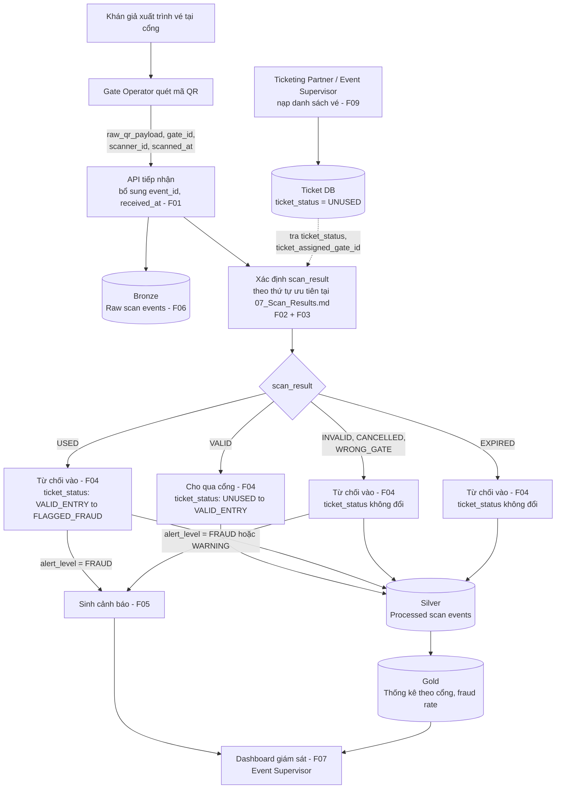

# 04. MVP Scope & Flow Specification

Tài liệu này xác định phạm vi sản phẩm khả thi tối thiểu (MVP) và chuẩn hóa luồng xử lý nghiệp vụ
end-to-end, đảm bảo tính khép kín từ khâu tiếp nhận dữ liệu đầu vào đến quyết định nghiệp vụ và
hiển thị kết quả.

Tập kết quả scan, thứ tự ưu tiên và quy tắc cảnh báo nằm ở `07_Scan_Results.md`; tập trạng thái vé
nằm ở `06_Ticket_Lifecycle.md`. Tài liệu này tham chiếu tới hai nguồn đó, không định nghĩa lại.

---

## 1. Phân loại phạm vi tính năng (Feature Scope Matrix)

| Chức năng bắt buộc (Must-Have for MVP) | Nếu còn thời gian (Nice-to-Have) | Không làm (Out of Scope) |
| :--- | :--- | :--- |
| **F01 (Scan Ingestion):** Tiếp nhận scan event từ thiết bị quét tại các cổng. | Cơ chế lưu đệm ngoại tuyến (Offline Buffering) trên thiết bị quét khi mất kết nối mạng. | Cổng thanh toán trực tuyến và đặt mua vé của khán giả. |
| **F02 (Ticket Validation):** Kiểm tra mã vé tồn tại, đúng sự kiện, đúng cổng được chỉ định và trạng thái hiệu lực. | Phân quyền truy cập nâng cao (RBAC) chi tiết cho từng loại tài khoản nhân viên. | Xác thực sinh trắc học hoặc nhận diện khuôn mặt tại cổng. |
| **F03 (Fraud Detection):** Phát hiện gian lận vé trùng lặp giữa các cổng trong khoảng thời gian ngắn (Duplicate Scan). | Gửi thông báo đẩy tức thời qua Telegram / Zalo / SMS cho lực lượng an ninh cơ động. | Ứng dụng di động cho khán giả lưu trữ ví vé điện tử cá nhân. |
| **F04 (Entry Feedback):** Phản hồi trạng thái xác thực chuẩn về máy quét theo tập kết quả của `07_Scan_Results.md`. | Phân tích cụm phát hiện bất thường (Anomaly Clustering) bằng mô hình học máy. | Hệ thống quản lý sơ đồ phân bổ ghế ngồi chi tiết 3D. |
| **F05 (Fraud Alerting):** Bắn tín hiệu cảnh báo trực tiếp lên giao diện giám sát trung tâm. | Xuất báo cáo thống kê chuyên sâu định dạng PDF / Excel có chữ ký số. | Tích hợp điều khiển hệ thống cửa xoay tự động vật lý (Turnstile Hardware). |
| **F06 (Event Audit Logging):** Lưu trữ toàn bộ dữ liệu scan thô (Bronze) để phục vụ kiểm toán, đối soát và replay luồng dữ liệu. | | |
| **F07 (Live Monitoring Dashboard):** Bảng hiển thị số lượt quét theo cổng, danh sách cảnh báo và tỷ lệ gian lận theo thời gian thực. | | |
| **F08 (Ticket & Event CRUD):** Quản trị danh mục sự kiện và danh sách mã vé (tạo mới, cập nhật, tra cứu, xóa). | | |
| **F09 (Import Valid Ticket List):** Nhập dữ liệu danh sách vé hợp lệ ban đầu từ tập tin (CSV/JSON) hoặc API đối tác vào cơ sở dữ liệu. | | |

---

## 2. Sơ đồ luồng xử lý MVP (MVP Flow Diagram)

Sơ đồ này thể hiện **luồng end-to-end**, không lặp lại logic phân nhánh của `07_Scan_Results.md`.
Bước xác định `scan_result` được gói trong một hộp duy nhất, để khi thứ tự ưu tiên ở 07 thay đổi
thì sơ đồ này không phải sửa theo.

### Đọc sơ đồ

- **Chuẩn bị trước sự kiện:** danh sách vé được nạp qua F09, mọi vé khởi tạo ở `UNUSED`.
- **Điểm đầu:** thao tác quét của Gate Operator, sinh ra một scan event.
- **Tách hai nhánh ngay sau API:** một nhánh ghi thô xuống Bronze phục vụ audit và replay (F06),
  một nhánh đi vào xử lý nghiệp vụ.
- **Hộp xác định `scan_result`** gói toàn bộ F02 và F03. Chi tiết sáu bước nằm ở 07.
- **Điểm cuối:** phản hồi về máy quét, cập nhật `ticket_status` nếu có, ghi xuống Silver, và đẩy
  cảnh báo lên dashboard khi `alert_level` khác `NONE`.

Hai kết quả duy nhất làm đổi `ticket_status` là `VALID` và `USED` trên vé đang `VALID_ENTRY` —
xem bảng ánh xạ ở cuối `06_Ticket_Lifecycle.md`.

---

## 3. Đối soát tính nhất quán & Tiêu chuẩn nghiệm thu

1. **Tính hoàn chỉnh (End-to-End):**
   * **Khởi tạo dữ liệu (Pre-event):** danh sách vé được nạp qua `F09 / UC06` trước khi sự kiện mở
     cửa, khởi tạo trạng thái ban đầu là `UNUSED`.
   * **Điểm đầu (Input):** thao tác quét vé của `Gate Operator`, phát sinh scan event chứa
     `raw_qr_payload`, `gate_id`, `scanner_id`, `scanned_at`, được API bổ sung `event_id` và
     `received_at`.
   * **Xử lý trung gian (Processing & Logic):** ghi log kiểm toán xuống Bronze (`F06`), xác thực vé
     (`F02`) và phát hiện gian lận (`F03`) theo thứ tự ưu tiên tại `07_Scan_Results.md`.
   * **Điểm cuối (Output):** phản hồi tức thì về thiết bị soát vé (`F04`), cập nhật `ticket_status`
     khi cần, ghi bản ghi đã xử lý xuống Silver, và đẩy cảnh báo lên giao diện của
     `Event Supervisor` (`F05`, `F07`) khi `alert_level` khác `NONE`.

2. **Tính độc lập:**
   * Mọi chức năng bắt buộc (`F01` đến `F09`) đều hoạt động độc lập, không phụ thuộc vào bất kỳ
     tính năng nào ở cột **Nice-to-Have** hay **Out of Scope**.

3. **Tính kế thừa và nguồn gốc:**
   * Danh mục `F01`–`F09` khớp với `03_Functions.md` và ánh xạ đầy đủ `UC01`–`UC06` của
     `05_Use_Cases.md`.
   * Tập trạng thái vé lấy nguyên từ `06_Ticket_Lifecycle.md`: `UNUSED`, `VALID_ENTRY`,
     `FLAGGED_FRAUD`, `EXPIRED`, `CANCELLED`.
   * Tập kết quả scan, thứ tự ưu tiên và quy tắc cảnh báo lấy nguyên từ `07_Scan_Results.md`.
   * Tài liệu này **không** định nghĩa lại bất kỳ tập giá trị nào ở trên. Khi 06 hoặc 07 thay đổi,
     chỉ phần mô tả tham chiếu cần rà lại, sơ đồ không phải vẽ lại.
