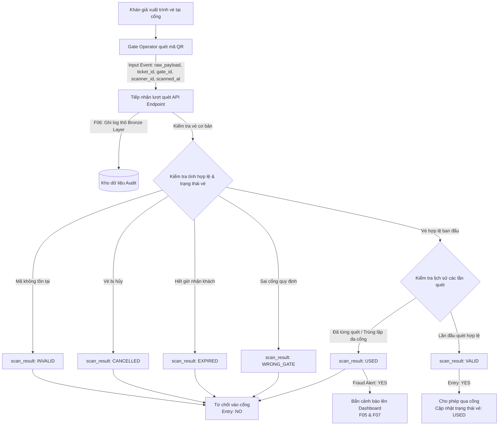

# 04. MVP Scope & Flow Specification

Tài liệu này xác định phạm vi sản phẩm khả thi tối thiểu (MVP) và chuẩn hóa luồng xử lý nghiệp vụ end-to-end, đảm bảo tính khép kín từ khâu tiếp nhận dữ liệu đầu vào đến quyết định nghiệp vụ và hiển thị kết quả.

---

## 1. Phân loại phạm vi tính năng (Feature Scope Matrix)

| Chức năng bắt buộc (Must-Have for MVP) | Nếu còn thời gian (Nice-to-Have) | Không làm (Out of Scope) |
| :--- | :--- | :--- |
| **F01 (Scan Ingestion):** Tiếp nhận scan event từ thiết bị quét tại các cổng (Ticket ID, Gate ID, Scanner ID, Timestamp). | Cơ chế lưu đệm ngoại tuyến (Offline Buffering) trên thiết bị quét khi mất kết nối mạng. | Cổng thanh toán trực tuyến và đặt mua vé của khán giả. |
| **F02 (Ticket Validation):** Kiểm tra mã vé tồn tại, đúng sự kiện, đúng cổng được chỉ định và trạng thái hiệu lực. | Phân quyền truy cập nâng cao (RBAC) chi tiết cho từng loại tài khoản nhân viên. | Xác thực sinh trắc học hoặc nhận diện khuôn mặt tại cổng. |
| **F03 (Fraud Detection):** Phát hiện gian lận vé trùng lặp giữa các cổng trong khoảng thời gian ngắn (Double Scanning / Duplicate Scan). | Gửi thông báo đẩy tức thời qua Telegram / Zalo / SMS cho lực lượng an ninh cơ động. | Ứng dụng di động cho khán giả lưu trữ ví vé điện tử cá nhân. |
| **F04 (Entry Feedback):** Phản hồi trạng thái xác thực chuẩn về máy quét (`VALID`, `INVALID`, `USED`, `CANCELLED`, `EXPIRED`, `WRONG_GATE`). | Phân tích cụm phát hiện bất thường (Anomaly Clustering) bằng mô hình học máy. | Hệ thống quản lý sơ đồ phân bổ ghế ngồi chi tiết 3D. |
| **F05 (Fraud Alerting):** Bắn tín hiệu cảnh báo gian lận trực tiếp lên giao diện giám sát trung tâm. | Xuất báo cáo thống kê chuyên sâu định dạng PDF / Excel có chữ ký số. | Tích hợp điều khiển hệ thống cửa xoay tự động vật lý (Turnstile Hardware). |
| **F06 (Event Audit Logging):** Lưu trữ toàn bộ dữ liệu scan thô (Bronze) để phục vụ kiểm toán, đối soát và replay luồng dữ liệu. | | |
| **F07 (Live Monitoring Dashboard):** Bảng hiển thị số lượt quét theo cổng, danh sách gian lận và tỷ lệ gian lận theo thời gian thực. | | |
| **F08 (Ticket & Event CRUD):** Quản trị danh mục sự kiện và danh sách mã vé (tạo mới, cập nhật, tra cứu, xóa trong cơ sở dữ liệu). | | |

---

## 2. Sơ đồ luồng xử lý MVP (MVP Flow Diagram)

---

## 3. Đối soát tính nhất quán & Tiêu chuẩn nghiệm thu

1. **Tính hoàn chỉnh (End-to-End):**
   * **Điểm đầu (Input):** Thao tác quét vé của `Gate Operator` tại cổng vào, phát sinh sự kiện dữ liệu chứa thông tin mã vé, cổng, máy quét và thời gian.
   * **Xử lý trung gian (Processing & Logic):** Kiểm tra tính hợp lệ, lưu vết thô phục vụ kiểm toán (`F06 Audit Logging`), và đối chiếu lịch sử quét để phát hiện trùng lặp/gian lận (`F03 Fraud Detection`).
   * **Điểm cuối (Output):** Phản hồi tức thì về thiết bị soát vé tại cổng theo đúng tập kết quả chuẩn (`VALID`, `INVALID`, `USED`, `CANCELLED`, `EXPIRED`, `WRONG_GATE`), đồng thời đẩy cảnh báo tức thời lên giao diện của `Event Supervisor` (`F07 Live Monitoring Dashboard`).

2. **Tính độc lập:**
   * Mọi chức năng cốt lõi bắt buộc (`F01` đến `F08`) đều hoạt động độc lập, không bị phụ thuộc vào bất kỳ tính năng mở rộng nào ở cột **Nice-to-Have** hay **Out of Scope**.

3. **Tính kế thừa và nguồn gốc:**
   * Danh mục mã chức năng từ `F01` đến `F08` khớp 100% với tài liệu `03_Functions.md`.
   * Tập kết quả phản hồi của MVP đồng bộ hoàn toàn với danh mục kết quả tại `07_Scan_Results.md`.
