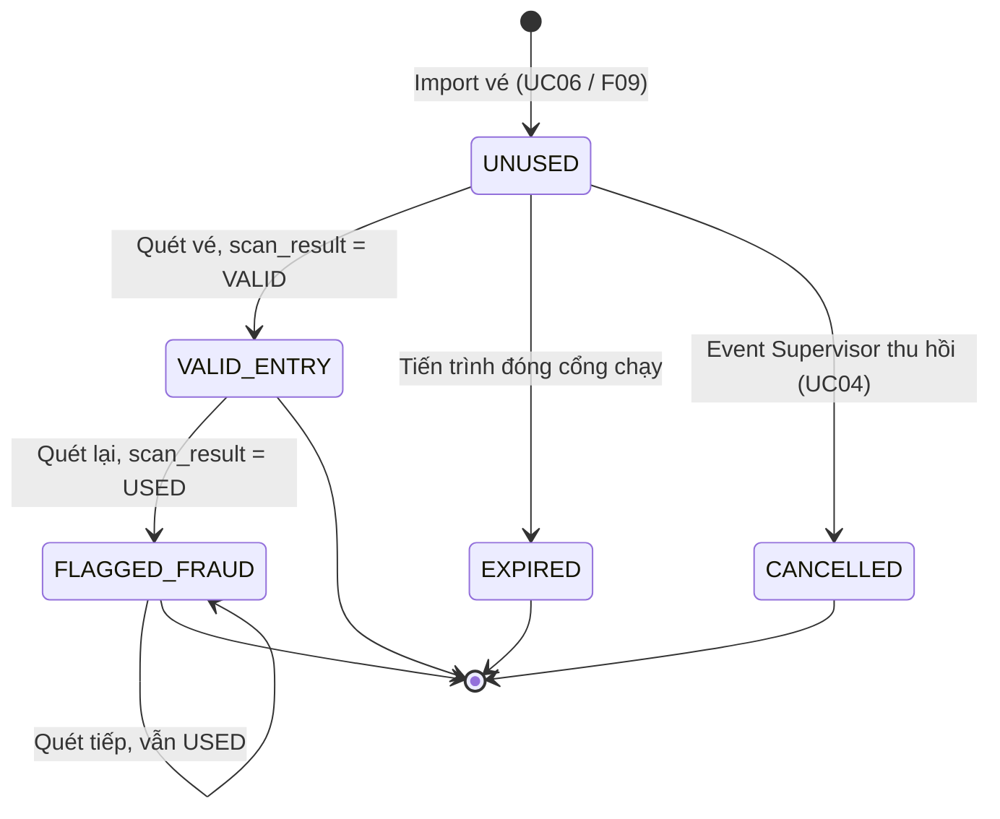

# 06 — Ticket Lifecycle (Phase 1 · 1.2)

Tài liệu này là **nguồn chuẩn duy nhất** cho tập trạng thái của ticket. Các tài liệu khác tham chiếu
tới đây, không định nghĩa lại.

Phân biệt: **trạng thái ticket** (tài liệu này) khác với **kết quả của một lần scan**
(`07_Scan_Results.md`). Ticket chỉ có một trạng thái tại một thời điểm; scan result được tính riêng
cho từng lượt quét.

## Quyết định nghiệp vụ chốt trước

**Vé đã dùng thành công có được dùng để vào lại không? → KHÔNG.** Hệ thống áp dụng chính sách
single-entry: mỗi vé chỉ được ghi nhận vào hợp lệ một lần (khớp F03 — "vé đã qua cổng nhưng được
quét lại" là định nghĩa gian lận). Bất kỳ lượt quét nào sau lần vào hợp lệ đầu tiên đều bị xử lý
theo nhánh gian lận, chuyển ticket sang `FLAGGED_FRAUD`, không quay lại trạng thái đã vào hợp lệ.

## Danh sách trạng thái

| Trạng thái | Ý nghĩa |
|---|---|
| **UNUSED** | Vé hợp lệ, chưa từng được quét thành công lần nào |
| **VALID_ENTRY** | Vé đã được quét hợp lệ và cho vào, tại một gate, một thời điểm xác định |
| **FLAGGED_FRAUD** | Có lượt quét thứ hai (hoặc hơn) cho cùng vé sau khi đã ở `VALID_ENTRY`, được xác nhận là gian lận |
| **EXPIRED** | Vé còn ở `UNUSED` nhưng đã hết giờ nhận khách mà chưa từng được quét thành công |
| **CANCELLED** | Vé bị Event Supervisor thu hồi qua chức năng quản trị (F08/UC04) |

Cả năm trạng thái đều **được lưu trong DB**, ở cột `ticket_status` của bảng ticket. `EXPIRED` là một
trạng thái lưu thật, không phải giá trị tính tạm tại thời điểm quét.

**Trạng thái đầu:** `UNUSED` — mọi vé nhập vào hệ thống (qua UC06 / F09) đều bắt đầu ở đây.

**Trạng thái cuối:** `VALID_ENTRY`, `FLAGGED_FRAUD`, `EXPIRED`, `CANCELLED` — không có transition đi
tiếp sang trạng thái khác trong phạm vi hệ thống này.

## Bảng transition

| Từ | Đến | Hành động gây ra | Điều kiện |
|---|---|---|---|
| `UNUSED` | `VALID_ENTRY` | Gate Operator quét vé (UC01) | Lượt quét cho `scan_result = VALID`: vé chưa dùng, không bị hủy, còn trong giờ nhận khách, đúng cổng |
| `UNUSED` | `EXPIRED` | Tiến trình định kỳ đóng cổng | Đã hết giờ nhận khách của sự kiện, vé vẫn còn `UNUSED` |
| `UNUSED` | `CANCELLED` | Event Supervisor thu hồi vé (UC04) | Thao tác quản trị chủ động, trước khi vé được dùng |
| `VALID_ENTRY` | `FLAGGED_FRAUD` | Gate Operator quét lại cùng vé (UC01 → UC02) | Lượt quét cho `scan_result = USED` trên vé đang ở `VALID_ENTRY` |

### Về transition `UNUSED → EXPIRED`

Tiến trình định kỳ chạy theo chu kỳ, không tức thời. Một lượt quét rơi vào khoảng giữa thời điểm
đóng cổng và thời điểm tiến trình chạy sẽ vẫn thấy `ticket_status = UNUSED`.

Vì vậy bước xử lý scan **không chỉ đọc `ticket_status`** mà còn so `received_at` với giờ nhận khách,
và trả `scan_result = EXPIRED` cho cả hai trường hợp — xem bước 4 trong precedence của
`07_Scan_Results.md`. Lượt quét đó không tự chuyển trạng thái vé; việc chuyển trạng thái vẫn do
tiến trình định kỳ làm.

## Self-transition

`FLAGGED_FRAUD → FLAGGED_FRAUD` được phép và **không tính là đổi trạng thái**. Một vé đã bị đánh dấu
gian lận, nếu tiếp tục bị quét lần thứ ba, thứ tư, sẽ cho `scan_result = USED` và sinh cảnh báo mới
mỗi lần, nhưng `ticket_status` giữ nguyên `FLAGGED_FRAUD`.

Không có self-transition nào khác trong hệ thống. Cụ thể, không có `VALID_ENTRY → VALID_ENTRY`:
mọi lượt quét sau lần vào hợp lệ đầu tiên đều dẫn tới `FLAGGED_FRAUD`.

## Transition KHÔNG được phép

- **`VALID_ENTRY` → `UNUSED`**: vé đã vào hợp lệ không được đưa trở lại trạng thái chưa dùng.
- **`VALID_ENTRY` → `VALID_ENTRY`**: không có "vào lần hai hợp lệ".
- **`FLAGGED_FRAUD` → trạng thái khác**: một khi đã bị đánh dấu gian lận, ticket không quay lại được
  trạng thái hợp lệ trong phạm vi hệ thống này. Self-transition về chính nó là ngoại lệ duy nhất.
- **`EXPIRED` → `VALID_ENTRY`**, **`CANCELLED` → `VALID_ENTRY`**: vé đã hết hiệu lực hoặc đã bị hủy
  thì không thể quét vào được nữa.
- **`UNUSED` → `FLAGGED_FRAUD`**: không tồn tại. Một vé bị cảnh báo `WRONG_GATE_FRAUD` (đã thử sai
  hết mọi cổng không phải của nó) **vẫn giữ nguyên `UNUSED`** và vẫn vào được đúng cổng của mình.
  Lý do đầy đủ nằm ở cuối `07_Scan_Results.md`.

## Sơ đồ trạng thái

## Ánh xạ trạng thái với scan result

| Trạng thái trước khi quét | Scan result tương ứng | Trạng thái sau khi quét |
|---|---|---|
| `UNUSED`, còn giờ, đúng cổng | `VALID` | `VALID_ENTRY` |
| `UNUSED`, còn giờ, sai cổng | `WRONG_GATE` | `UNUSED` (không đổi) |
| `UNUSED`, ngoài giờ | `EXPIRED` | `UNUSED` (không đổi) |
| `VALID_ENTRY` | `USED` | `FLAGGED_FRAUD` |
| `FLAGGED_FRAUD` | `USED` | `FLAGGED_FRAUD` (không đổi) |
| `EXPIRED` | `EXPIRED` | `EXPIRED` (không đổi) |
| `CANCELLED` | `CANCELLED` | `CANCELLED` (không đổi) |
| Vé không tồn tại | `INVALID` | — |
